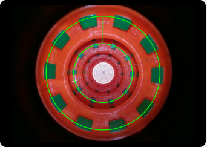

Hello from MOIL LAB
===================

This is tutorial how create documentation using Sphinx

Install Package
------------------

before using first you need to install package 

 * open terminal
 * create environtment python and activate that venv
 * type this for installing package **pip install sphinx**
 * create folder location
   * you can clone from repository or create new folder by your self
 * create folder for specific documentation inside main folder
 * open that directory
 * type this command **sphinx-quickstart**
 * fill specific exstention you want
 * for testing first time you can type this command **make html**
 * from this doc go to build and html and open *index.html*
 * your documentation will show on your browser
 
Change theme from third party
----------------------------- 
 This part will explain how to change theme become read the doc theme

 1. install package **pip install sphinx_rtd_theme**
 2. open file *conf.py*
 3. add **import sphinx_rtd_theme**
 4. change *'alabastar'* to *'sphinx_rtd_theme'*
 
Python Code
------------------

 1. open cont.py and change directory to location off *src code* relative with *source*
 2. you can create file **.rst** from your package 
 3. open your terminal in doc directory and type this command
    **sphinx-apidoc -o <location for save rst> <location of your source code>**
 4. after finish all off your file in *src code* will become *.rst*
 5. you can henerate by typing *make html*
 6. you can also create structure by using that file

Add external link
------------------------

you can add link for referenc or connect to another page

  * you type like this
  
  * *.. _a link: https://docutils.sourceforge.io/docs/ref/rst/directives.html#image*
  
  * and you just need call that command with the name **`a link`**
  
This is a paragraph that contains `a link`_.

.. _a link: https://docutils.sourceforge.io/docs/ref/rst/directives.html#image

 
Add Image from Directory
------------------------

  * Select photo
  * type this command
    *.. image:: image.jpg*
  * fill the *image.jpg* with location off image *relative by source directory*
  

This is a paragraph that contains `a link`_.

.. _a link: https://docutils.sourceforge.io/docs/ref/rst/directives.html#image

Add Video from youtube
-----------------------

this video i get from youtube from **Dan Sheffner**

 1. you can type **.. raw:: html** and 
 2. select link video format *Embed Video*
  
  .. raw:: html
  
    <iframe width="560" height="315" src="https://www.youtube.com/embed/qrcj7sVuvUA?controls=0" title="YouTube video player" frameborder="0" allow="accelerometer; autoplay; clipboard-write; encrypted-media; gyroscope; picture-in-picture" allowfullscreen></iframe>
    
Add Warning and other
---------------------

this section will give you info for user
  * you can using 
  * you only need to type **.. warning::**
  * another option 
    
    *"attention", "caution", "danger", "error", "hint", "important", "note", "tip", "warning", "admonition"*

.. warning::
   **warning!** make sure everything work or contact me
   
.. note::
   please be kind
  

